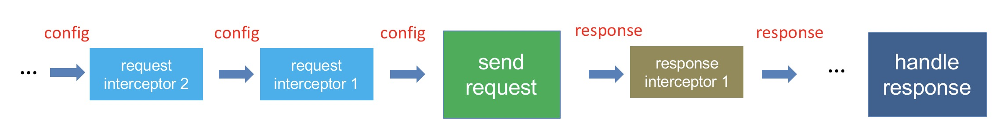

## 拦截器
请求拦截器在请求之前执行，用于对 config 的处理
相应拦截器在收到相应之后执行，用于对 response 的处理

### InterceptorManager
```js
function InterceptorManager() {
  this.handlers = [];
}

/**
 * Add a new interceptor to the stack
 *
 * @param {Function} fulfilled The function to handle `then` for a `Promise`
 * @param {Function} rejected The function to handle `reject` for a `Promise`
 *
 * @return {Number} An ID used to remove interceptor later
 */
InterceptorManager.prototype.use = function use(fulfilled, rejected) {
  this.handlers.push({
    fulfilled: fulfilled,
    rejected: rejected
  });
  return this.handlers.length - 1;
};

/**
 * Remove an interceptor from the stack
 *
 * @param {Number} id The ID that was returned by `use`
 */
InterceptorManager.prototype.eject = function eject(id) {
  if (this.handlers[id]) {
    this.handlers[id] = null;
  }
};
```

## 使用 promise chain 来执行拦截器中的回调
```js
Axios.prototype.request = function request(config) {
  
  // Hook up interceptors middleware
  var chain = [dispatchRequest, undefined];
  var promise = Promise.resolve(config);

  this.interceptors.request.forEach(function unshiftRequestInterceptors(interceptor) {
    chain.unshift(interceptor.fulfilled, interceptor.rejected);
  });

  this.interceptors.response.forEach(function pushResponseInterceptors(interceptor) {
    chain.push(interceptor.fulfilled, interceptor.rejected);
  });

  while (chain.length) {
    promise = promise.then(chain.shift(), chain.shift());
  }

  return promise;
};
```

request 拦截器就是在 dispatchRequest 之前用 unshift 加入回调函数，而 response 拦截器是在 dispatchRequest 之后用 push 加入回调函数
所以拦截器的执行顺序是

